# Architecture

## Glossary

| Term              | Description                                                                                                                                                                                                                                                                                                                                                                                                                                                                                          |
| ----------------- | ---------------------------------------------------------------------------------------------------------------------------------------------------------------------------------------------------------------------------------------------------------------------------------------------------------------------------------------------------------------------------------------------------------------------------------------------------------------------------------------------------- |
| Node Operator     | An entity that is contributing to the decentralized oracles network (DON) operations by running the Chainlink node software. Also referred to as operators.                                                                                                                                                                                                                                                                                                                                          |
| Community Staker  | A Chainlink token holder who is not an Operator that is a participant of Staking v0.1.                                                                                                                                                                                                                                                                                                                                                                                                               |
| Staker            | A staker (an Operator or community staker) who stakes in the staking v0.1 pool.                                                                                                                                                                                                                                                                                                                                                                                                                      |
| Alerter           | A staker who raises a feed downtime alert on-chain.                                                                                                                                                                                                                                                                                                                                                                                                                                                  |
| Allowlist         | A list of Ethereum addresses that are allowed to stake during the Early Access phase.                                                                                                                                                                                                                                                                                                                                                                                                                |
| Base Reward       | A Staking Reward for Stakers is issued at a Reward Rate determined by the Staking v0.1 contract manager.                                                                                                                                                                                                                                                                                                                                                                                             |
| Delegation Reward | A % proportion of Base Rewards from Community Staker rewards that is divided evenly between all Operators who have staked the minimum required amount. Delegation rewards are divided evenly to each Operator based on the total number of Operators, independent of amounts staked by individual Operators.                                                                                                                                                                                         |
| Reward Rate       | This parameter expresses the reward amount in Juels per second per each micro LINK staked. For example for 1% annualized rewards, this variable is set to `10^ 12*0.01/31,536,000 = 317` and `60 * 60 * 24 * 365 = 31,536,000` is an approximate number of seconds in a year. `10^12` is used to mitigate rounding errors and reward for each `10^-6` LINK (micro LINK) staked. This is as opposed to using `10^18` (1 LINK) as a base unit which has the potential to create large rounding errors. |
| Juels             | Base unit (equal to 1 wei) in LINK. 1 LINK is `10^18` Juels.                                                                                                                                                                                                                                                                                                                                                                                                                                         |

## 1. Staking v0.1 Economics Design Overview

> Note: Any parameter values mentioned in tests or the Staking v0.1 codebase are for testing purposes only. These values will be changed once deployed in an in-production environment.

### Rewards

The Staking v0.1 pool will have an aggregate annual staking reward rate.

All Node Operators actively staking in Staking v0.1 will earn a percentage of the community stakers’ staking rewards—referred to as delegation rewards.

In Staking v0.1, a percentage of the staking rewards for community stakers are distributed evenly to participating NOP stakers (so called Delegation Rate). This means that there are two sources of rewards for each Node Operator Staker:

```
Base Staking reward = staking reward rate * duration * the Node Operator’s stake
Delegation reward = staking reward rate * duration * delegation rate * total community stake / number of Node Operator stakers
```

The total annualized rewards for Node Operator Stakers will depend on the amount of staked LINK by the node, the total amount of community stake, and the number of actively staking Node Operators. The formula for community stakers is as follows:

```
Community staker’s reward = staking reward rate * duration * (100% - delegation rate) * their stake.
```

### Alerting and Reward Slashing

The alerting mechanism allows stakers to raise a flag if they observe an event where the oracle service has not met certain predefined performance standards. If the alert is valid, the alerting staker will earn an Alerting Reward.

In v0.1, stakers can raise a valid alert on the ETH/USD Data Feed on Ethereum Mainnet if a new oracle report has not been submitted on-chain for more than three hours since the previous on-chain update. Node Operator Stakers will start out with priority in alerting, with the ability to raise a valid alert during a “Priority Period” if it has been more than three hours since the latest on-chain oracle report.

Once the Priority Period has ended, any Staker can raise an alert if a valid alert has not yet been raised. Once the first valid alert for the feed is raised, any additional alerts raised during the same downtime event will be invalid.

Because oracle reports are submitted on-chain, the Staking v0.1 smart contract will automatically adjudicate the validity of any alert by checking the time between the alert and the last on-chain update. Invalid alerts (i.e. downtime threshold not met) will result in reverted transactions while valid alerts will enforce penalties.

Depending on the time the alert is raised, a valid alert during the Priority Period can earn a staking node operator an alerting reward, denoted as _Max_Alerting_Reward_. Any staker who raises a valid alert after the Priority Period can earn up to half of their staked amount, up to the Max_Alerting_Reward amount based on the following formula:

```
_min(Max_Alerting_Reward, 0.5 * staked_link)
```

If a valid alert is raised for downtime on the ETH/USD feed, then the node operators currently serving that feed are subject to lose a portion of their accrued staking rewards. The reward pentalization for actively staking Node Operators servicing the ETH/USD Ethereum Data Feed once a valid alert is raised at time _t_ is as follows:

```
Reward Deduction = min(node_net_accumulated_rewards_t, (three_months_base_rewards + three_months_delegation_rewards)
```

where:

```
Three_months_base_rewards = staking_reward_rate_t * 3 months * min_node_required_stake

Three_months_delegation_rewards = staking_reward_rate_t  * 3 months * delegation_rate% * total_community_stake_t / number_operator_stakers_t
```

The variables denoted with a “t” represent their value at the time when the alert was raised, as they may not be constant.

Node Operator stakers who are not serving the ETH/USD Ethereum Data Feed will not see their rewards slashed.

## 2. Architecture

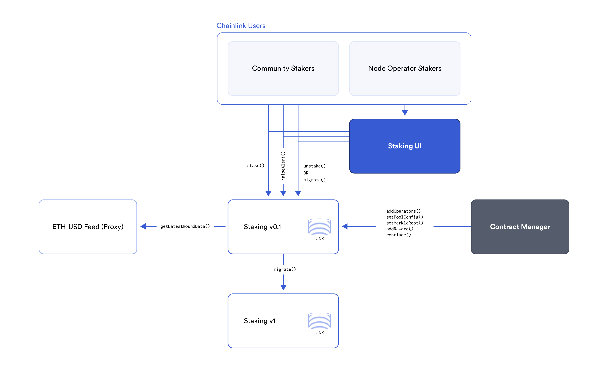

#### Contract Descriptions

- **Staking.sol:** The Staking v0.1 pool contract is responsible for receiving stakes and distributing rewards to stakers. Also handles pool config management, node operator management, Merkle allowlist, alerting, and migrations.

#### External Components

- **LINK Token**: The Staking v0.1 contract uses the LINK token for both staking and rewards. The ERC677 transferAndCall function is the primary method of staking into the pool.
- **ETH-USD feed**: The Alerting feature reads the latest round timestamp from the ETH-USD proxy contract to determine if the feed downtime threshold is met and an alert can be raised.
- **Staking v1**: A yet to be implemented future staking pool contract. At the conclusion of Staking v0.1, stakers can choose to migrate their stake to the new staking pool.

## 3. Staking v0.1 Entry Access

During the Early Access Period, the Staking v0.1 pool only allows a list of [eligible addresses](https://blog.chain.link/chainlink-staking-early-access-eligibility-app/) to stake.

The primary engineering challenge here is storing and managing a mutable list of 200,000+ addresses. To solve this problem gas-efficiently, instead of storing the list of addresses on-chain, a Merkle tree data structure off-chain is generated off-chain and only a Merkle root is stored on-chain. This significantly decreases the gas costs for storing and updating the allowlist.

The Merkle Tree data structure is generated from the allowlist containing a list of staker addresses eligible to stake during the Early Access period. The root hash of this Merkle tree is stored on-chain for verification purposes, while the full tree containing all leaves is made publicly available for transparency on Github.

The following diagram summarizes the staking entry flow:

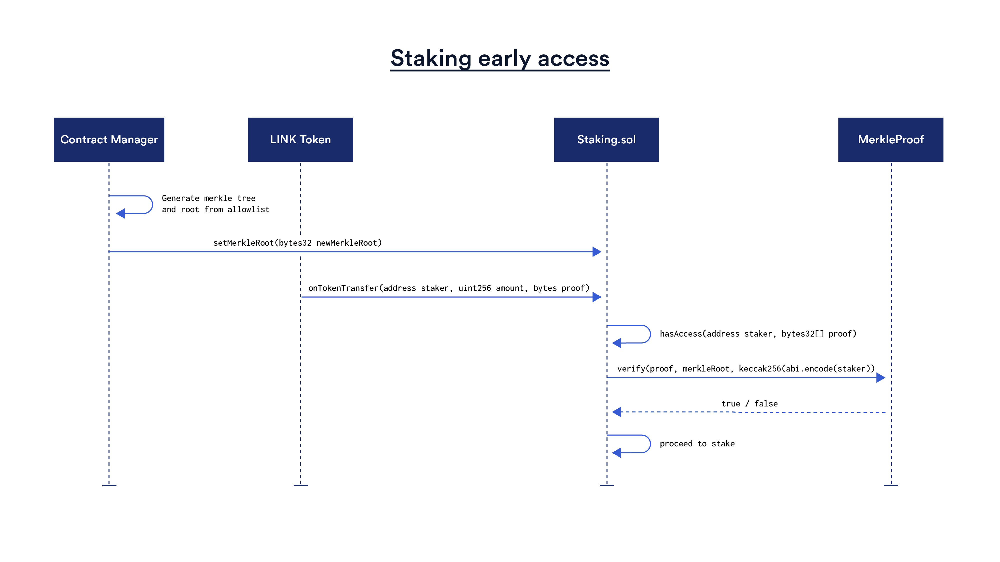

To stake, a staker sends a LINK.transferAndCall to the Staking v0.1 pool.

To successfully stake during Early Access, the staker’s address must be in the allowlist and they must submit a valid Merkle proof. On the Staking UI, this proof input will be auto-filled for the staker using the Merkle tree generated from the allowlist.

During General Access, the Allowlist check is disabled and everyone (addresses both on and not on the Allowlist) can stake. The contract manager sets the Merkle root to empty bytes during this phase.

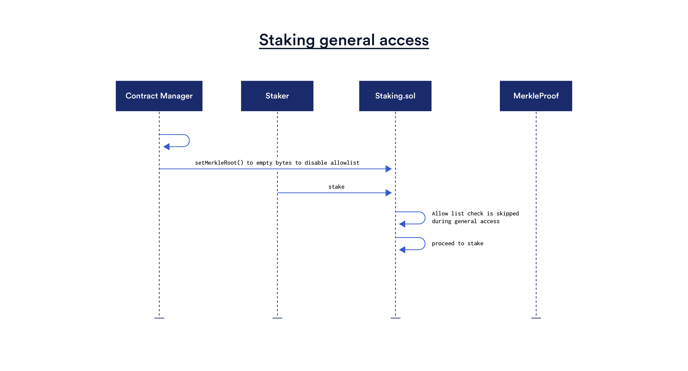

The **IMerkleAccessController** interface defines functions to check if a staking request is valid. It also includes functions to store the Merkle root hash and verify Merkle proofs.

The contract manager can update the Merkle root in order to set the active allowlist.

## 4. Staking into the Pool

The `onTokenTransfer()` function is the main entry point to the Staking v0.1 pool.

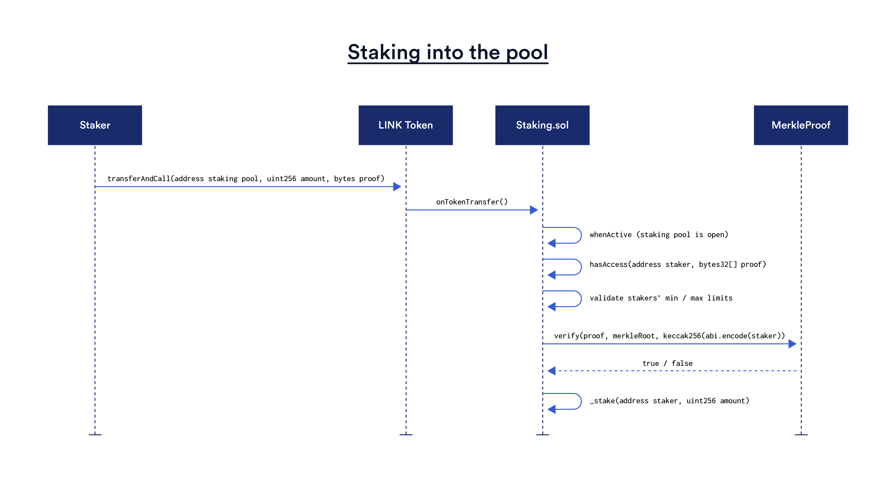

The Staking v0.1 pool responds to the LINK token’s [transferAndCall](https://github.com/ethereum/EIPs/issues/677) function, receives tokens, and increases the staker’s balance in a single transaction (as opposed to the approve + transferFrom pattern.) The transferAndCall function transfers tokens to the receiver and calls an `onTokenTransfer(address,uint256,bytes)` function on the receiver forwarding the sender, the amount, and additional bytes data as parameters.

To successfully stake, the staker’s final staked balance must be within the staker’s min/max stake limits. The Staking v0.1 pool must also be open and within the max pool size. Users can stake multiple times as long as the above conditions are met.

## 5. Staking v0.1 Rewards

#### Reward formula

The Staking v0.1 pool has a fixed annual reward rate in aggregate, currently set at a test value. However, the reward and penalty systems for each type of staker will differ due to the Delegation Reward mechanism, which determines the effective annualized rewards for each category of staker. The following formula is used to calculate rewards:

```
reward amount = amount of LINK staked * duration in seconds * reward rate
```

Duration is in seconds. Reward rate is expressed in Juels per second per micro LINK staked.

#### Reward duration

When Staking v0.1 starts, the pool is seeded with a specified amount of LINK rewards for the entire max pool size, which lasts for a reward duration. The reward duration is calculated as follows:

```
reward duration = (available LINK rewards - reserved and earned rewards) / (reward rate * max pool size)
```

The reward duration begins at reward.startTimestamp and ends at reward.endTimestamp. The end timestamp is the time when available rewards will run out at the current reward rate, assuming that the pool size is full.

#### Calculating rewards for late entries

Stakers receive more rewards if they stake **larger amounts** for **a longer duration**. To calculate each stakers’ reward correctly, the exact duration each amount was staked must be known. However, stakers can stake at any time and it’s not gas efficient to store the timestamps of each new stake deposit for each individual staker.

To solve this, a deduction variable is introduced for each staker. **Whenever a staker stakes, the reward accrued for the new amount of LINK staked since the start of staking is added to the staker’s missedReward deduction variable.** This amount accounts for rewards that the staker was not present for

```
elapsed duration = block.timestamp - reward.startTimestamp

missed reward += amount of new LINK staked * elapsedDuration * reward rate
```

When a staker unstakes, the staker’s missedReward is subtracted to calculate their final reward. This calculation produces an amount that accounts for late entries and reflects the staker’s total stake over time.

```
final reward amount = accrued reward - missed reward
```

Here’s a simple example:

#### Example 1: Calculating Base Rewards

Assume that the reward rate is **1 LINK per day for each 1000 LINK staked**.

1 day after Staking v0.1 started, the staker stakes 1,000 LINK. The staker’s staked amount becomes 1,000 LINK and the missedReward deduction is 1 LINK (the missed reward that would have been earned if the staker staked as soon as the reward is initialized).

99 days after Staking v0.1 started, the staker staked an additional 1,000 LINK. User’s staked amount becomes 2,000 LINK and deduction increases by 99 LINK (99 days \* 1 LINK per day) to 100 LINK total deduction for the missed reward.

100 days after Staking v0.1 starts the pool concludes. The staker’s reward is 100 LINK. This is because reward calculation returns (2 LINK per day \* 100 days - 100 LINK deduction). In other words, the staker earned 0 LINK during day 1, 98 LINK during days 2 - 99 and 2 LINK during day 100.

**Calculating earned and reserved rewards**

To track the utilization of rewards in the Staking v0.1 pool, **earned** and **reserved** rewards are accounted for.

When there is no stake in the Staking v0.1 pool, all LINK rewards in the Staking v0.1 pool are considered available and none are reserved for stakers.

Whenever new stake enters the Staking v0.1 pool, an amount of future rewards for that stake amount is reserved. Note that this is the total reward amount the staker would earn up to the remaining reward duration.

```
future rewards for stake = amount of new LINK staked * remaining reward duration * reward rate

reserved rewards += future rewards for stake
```

**Reserved** rewards is the sum of currently earned rewards (as of the current block timestamp) plus new future rewards based on the available reward duration.

```
reserved rewards = earned rewards + future rewards
```

Therefore, **Earned** rewards can be derived as the difference between reserved rewards and future (unearned) rewards.

```
earned rewards = reserved rewards - future rewards
```

The remaining duration is recalculated and updated whenever:

- The max pool size changed: a larger pool sizes depletes the same amount of rewards more quickly
- Reward rate is changed: a higher rate depletes rewards more quickly
- More rewards are added to the pool: a larger amount of rewards lasts for longer
- Operators have their rewards slashed when an alert is raised: rewards freed up from slashing increases the rewards pool

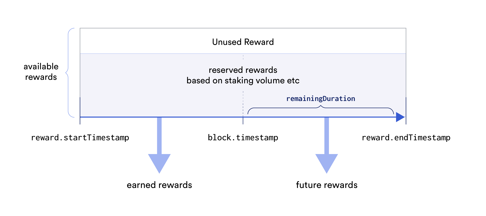

> The above diagram illustrates how earned (past) rewards and future rewards are calculated based on the remaining duration. It also shows reserved rewards (rewards assigned by stake in the pool) and available rewards (rewards in the pool that is not yet assigned.)

#### Accumulating changes to base reward rates

While unlikely to occur, the `emergencyChangeRewardRate` operation allows the contract manager to change the reward rate.

The rewards distribution model needs to still calculate both base and delegation rewards correctly even with multiple rate changes. To do so, the cumulative reward values are updated whenever the rate is changed.

Whenever the reward rate is changed, _accumulateBaseRewards()_ will multiply the current rate and elapsed duration and store it in the reward.base._cumulativePerMicroLINK_ variable, which is used in _calculate_ operation to account for reward rate changes. **After the base reward is accumulated, the reward start timestamp is reset to the current block timestamp (`reward.base.lastAccumulateTimestamp`) to avoid doubling rewards for the same period.** The reward start timestamp here refers to the starting time of the current reward rate.

The diagram below illustrates how past reward rates are accumulated with each rate change, based on the duration since the last time accumulate was called:

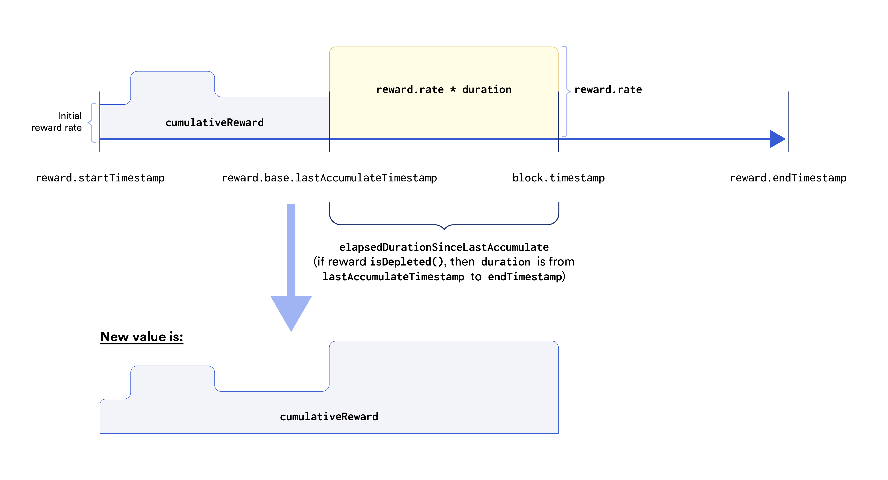

**Pseudocode for the accumulateBaseRewards() operation:**

```
elapsedDuration = block.timestamp - reward.startTimestamp

reward.base.cumulativePerMicroLINK += rewardRate * elapsedDuration

reward.base.lastAccumulateTimestamp = block.timestamp
```

The accumulate function stores a running snapshot of rewards per unit staked into the `cumulativePerMicroLink` variable.

**Pseudocode for the calculateBaseRewards() operation:**

```
elapsedDuration = block.timestamp - reward.startTimestamp2

baseReward = (reward.base.cumulativePerMicroLINK + (rewardRate* elapsedDuration)) * stakedAmount/1012
```

The calculate function returns the sum of `cumulativePerMicroLink` and the reward accrued during the latest reward epoch.

#### Delegation allocates a share of base rewards to operators

Community stakers delegate a percentage of their rewards to Operators. Delegated rewards are divided equally between all eligible Operators. An Operator is eligible for delegated rewards once they’ve staked a minimum amount required by the pool.

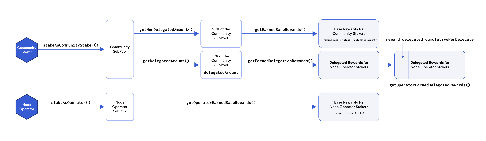

> The above diagram illustrates how rewards are distributed between Community Stakers and Operators.

In addition to receiving base rewards, operators receive a proportional share of delegation rewards. However, the number of Operators and delegated amount changes over time. This introduces the following problems:

- accounting for changes in Operators count when any Operator becomes eligible for delegation rewards, and
- accounting for changes in the total amount delegated when stakers stake or unstake.

An Operator becomes eligible for delegation reward when they stake a minimum amount defined in the Staking Pool Manager configuration. Therefore, delegation rewards can **accumulate** every time eligible operators’ count or delegated stake amount changes. **Accumulation captures a snapshot of the amount of delegated reward each Operator receives at that point in time.**

The _accumulateDelegationRewards()_ operation would:

- calculate the delegated reward,
- add it to the _base.delegated.cumulativeRewardDelegate_ and reset the _base.delegated.lastAccumulateTimestamp_ of the delegated reward to the current _block.timestamp_.

#### Accumulating changes to delegation reward rates

For delegation rewards, a similar operation is performed as base rewards with **_accumulateDelegationRewards()_** whenever the following changes:

- the reward rate,
- the number of delegates (Operators who have staked the minimum amount), and
- total delegated amount.

The _accumulateDelegationRewards()_ operation stores accumulated delegation reward in a _base.delegated.cumulativePerDelegate_ variable which is used when calculating deductions and final reward.

This accumulation occurs in parallel with base reward accumulation. Both types of rewards store their own cumulative amounts and last accumulated timestamps separately from each other.

The diagram below illustrates how the elapsed duration since the last accumulate call is used to accumulate delegation rewards:

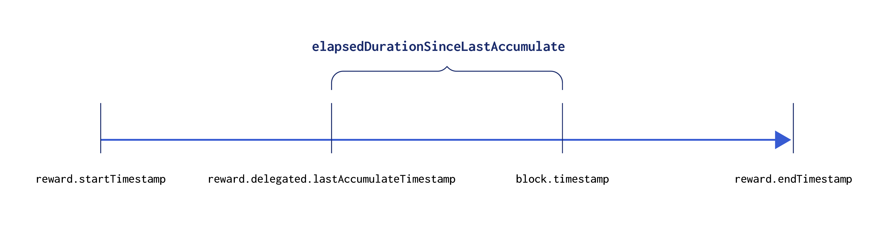

When a new operator becomes eligible for delegated rewards, the \_base.delegated.cumulativePerDelegate \_value is added to the operator’s missedReward deduction so the operator does not benefit from past delegated rewards they were not present for.

#### Example 2: Calculating Delegation Reward

The below example shows how stake from a Community Staker increases delegatedAmount, as well as how missedReward deductions work.

**Initial state**

```
reward.base.rate = 1
reward.startTimestamp = 0
delegationRate = 1%
```

**Alice (TH) stakes 1000 microLINK @ t=200s**

```
pool.stakedAmounts[0xalice] = 1,000 * 10^12
delegatedAmount = 10 * 10^12
missedRewards[0xalice].base = 0.99 * (1,000 / 10^12) * 200s * reward.base.rate = 198,000
```

**Alice (TH) stakes 1500 microLINK @ t=500s**

```
pool.stakedAmounts[0xalice] += 1,500 * 10^12 = 2,500 * 10^12
delegatedAmount += 15 * 10^12 = 25 * 10^12
missedRewards[0xalice].base += 0.99 * (1,500 / 10^12) * 500s * reward.base.rate = 940,500
```

**Alice (TH) unstakes @ t=1000s**

```
pool.stakedAmounts[0xalice] = 0
delegatedAmount = 0
missedRewards[0xalice].base = 0
calculateOutput = 0.99 * (2,500 / 10^12) * 1000s * reward.base.rate = 2,475,000
reward= calculateOutput - missedReward = 2,475,000 - 940,500 = 1,534,500
transferAmount= 2,500 * 10^12 (stake) + 1,534,500 (reward)
```

#### Summary: Staking v0.1 as a Community Staker Illustrated

The diagram below shows how staking as a community staker works:

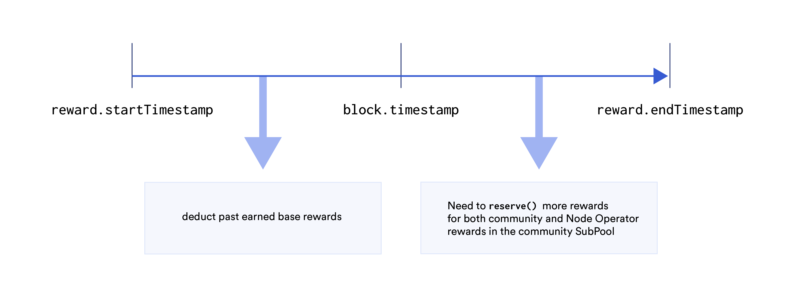

When a Community Staker stakes:

- The accumulateDelegationRewards() is called to capture the current value of reward.delegated.cumulativePerDelegate. This is because the totalDelegatedAmount will increase by the new stake amount and needs to be accounted for to ensure existing operators receive the correct amount of delegated rewards.
- Calculate past rewards (a percentage of the new stake from the start of Staking v0.1 to now using reward.base.cumulativePerMicroLink) and increase the staker’s missedReward variable by the amount. This ensures stakers do not receive past base rewards they were not present for.
- Calculate future rewards for the new stake amount (base rewards and delegated rewards) and mark it as reserved.

#### Summary: Staking v0.1 as an Operator Illustrated

The diagram below shows how staking as an operator works:

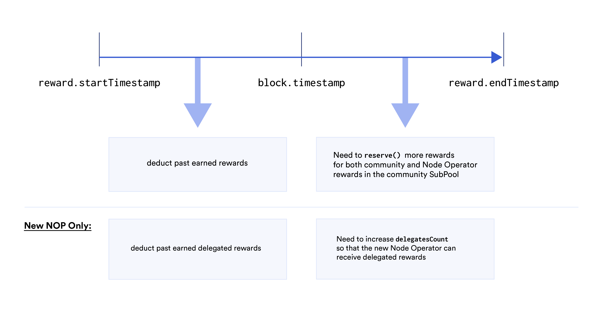

When an operator stakes:

- The accumulateDelegationRewards() is called to capture the current value of reward.delegated.cumulativePerDelegate. This is because the totalDelegatedAmount will increase by the new stake amount and needs to be accounted for to ensure existing operators receive the correct amount of delegated rewards.
- The number of delegates is increased, if the operator staked for the first time.
- Calculate past base rewards (100% of the new stake from the start of Staking v0.1 to now using reward.base.cumulativePerMicroLink) and increase the staker’s missedReward variable by the amount. This ensures the operator does not receive past base rewards they were not present for.
- Calculate past delegated rewards and increase the staker’s missedReward variable by the amount. This ensures the operator does not receive past delegated rewards they were not present for.
- Calculate future rewards for the new stake amount (100% of base rewards) and mark it as reserved.

## 6. Alerting and Reward Slashing

When a feed goes offline, stakers can report it by creating Alerts on-chain. Valid alerts receive an Alerting Reward (in LINK) paid from the staking reward pool. In v0.1, stakers can raise an alert for the ETH/USD feed.

To reduce the number of invalid alerts, an anti-spam mechanism (in the form of an on-chain feed staleness check) ensures that only valid alerts can be raised successfully.

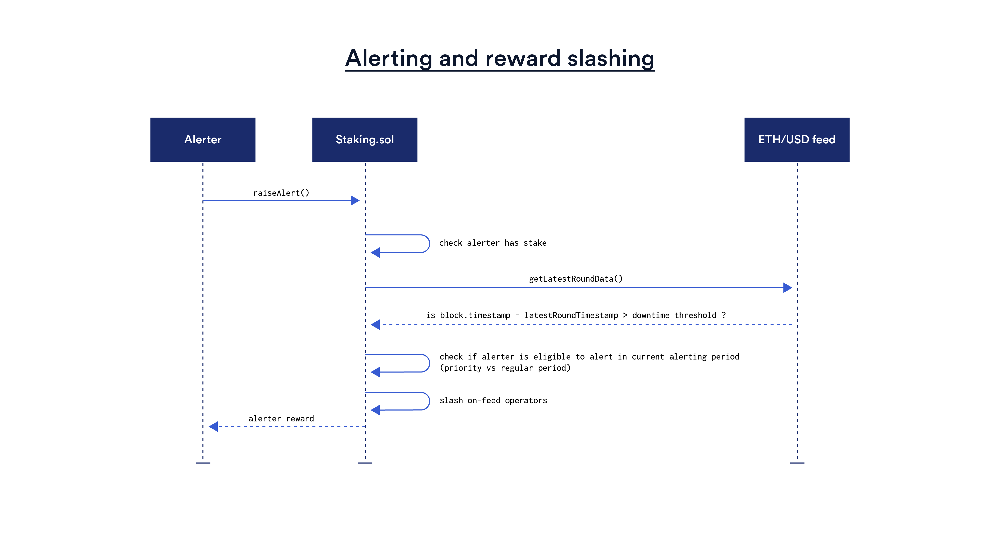

When a valid alert is raised, a list of on-feed Operator staking addresses set by the contract manager have their Staking Rewards slashed and the alerter receives LINK rewards. Only on-feed ETH-USD Operators have their Staking Rewards slashed.

#### Raising an alert

When stakers call _raiseAlert_, the contract first checks **whether the feed has been down for more than a predetermined amount of time based on the _latestRoundData()_'s timestamp value in the ETH-USD feed proxy contract.**

An Alert is raised if the above condition is met. Otherwise, the alert transaction reverts. This is equivalent to a transparent, automatic, objective and fast adjudication process.

In addition, after the feed has been down for a specified downtime threshold (say 3 hours), alerts can only be created during the following periods:

- **Priority Period (Operators only):** During the priority period, Operators who stake can raise an alert
- **Regular Period (All Stakers including Operators):** If no one raises an alert during the priority period, all stakers (Operators + Community Stakers) can alert and be eligible for an alerting reward

If all alerting conditions are met, the following will occur:

- an Alert is created on-chain and no other Alerts can be created for the feed round
- An internal `_slashFeedOperators` function is called to slash rewards from operators specified by the contract manager with `setFeedOperators()`
- an amount of rewards proportionate to the slashed amount is released / unreserved from Operators to future rewards
  - The reward duration is updated to account for newly available rewards.
- An alerting reward is transferred to the alerter

#### Slashing Operator rewards

A fixed amount approximately equal to the amount that operators would earn in the slashable duration is slashed. The slashable amount is calculated based on the current reward rate at the time of slashing against the minimum Operator stake amount and total delegated amount.

Slashed base rewards are calculated as:

```
slashed base rewards = min Operator stake amount * reward rate * slashable duration
```

Slashed delegated rewards are calculated as:

```
slashed delegated rewards = (total delegated amount / delegates count) * reward rate * slashable duration
```

Slashed rewards are accounted for using the operator’s _missedReward_ variable. Using the _slashFeedOperators_ operation this _missedReward_ value can increase to reduce both the base and delegated rewards earned by each Operator.

#### Alerting Rewards

The alerter will receive rewards when a valid alert is resolved. The alerting reward amount is calculated as follows:

- **Priority Period:** First Operator to alert receives the maximum alerting award in LINK;
- **Public Period:** The first Alerter (either a Community Staker or an Operator) who raises a valid alert receives **half of their current stake amount**, up to a maximum value.

**The LINK alerting rewards are sourced from the same pool of staking rewards.** When an alerter is paid out and feed operators have their rewards slashed, the Staking v0.1 pool’s available rewards and reward duration is updated to reflect the change in available and reserved LINK amounts. Since the slashed reward amount will usually exceed alerter rewards, reward duration will increase as a result of freed-up operators rewards. (Note: Reward for raiseAlert() Could Be Higher than the Total Slashed Reward: If the total earnings for the feed operators are less than the reward, this means that the reward for raiseAlert() is taken from the reward pool which could reduce the available reward for stakers. This is acknowledged.)

## 7. Contract Management

The contract manager is a privileged role that has the ability to perform the following limited operations:

#### a. Operator management

_addOperators_ and _removeOperators_ operations handle state changes and operator reward calculations when pool operators change.

- _addOperators_ adds new operators to the list of operators which reserves their stake allotment and grants them permissions to alert in the Priority Period.
- _removeOperators_ operation removes Operators from the list, resets their rewards, and makes their stake available for unlocking at the end of Staking v0.1. (NOTE: When a misbehaving operator is removed, all of their rewards are forfeited and only their principals remain. This is by design.)

A _setFeedOperators_ is a function callable by the contract manager. It stores a list of feed operators’ staking addresses that are subject to reward slashing.

- The contract manager can add / remove an Operator from the list of on-feed Operators by setting a different list of Operators.
- When a valid alert is created, each Operator in this list has their rewards slashed.

#### b. Pool configuration management

The Staking v0.1 pool has a maximum allowed pool size. The manager can call the \_setPoolConfig \_operation to increase:

- maximum pool size
- max Community Staker stake amount, and
- max Operator stake amount.

The above configuration values can only be increased.

#### c. Contract funding

The Staking v0.1 contract is funded with the _addReward_ operation. _addReward_ can be called more than once to extend the reward duration. Each time it is called it uses the amount of transferred tokens to add to available rewards and increase the reward duration.

The duration is extended using the same formula:

```
additionalRewardDuration = rewardsAmount / rewardRate / (maxPoolSize / 10^12)
```

#### e. Setting a migration target

The contract manager can set a contract address to signal where stake can be migrated to. Only the stakers themselves have control of migrating their stake to the new contract. This migration target address is planned to be a new Staking v1 pool where stake can be carried forward to after the Staking v0.1 program ends.

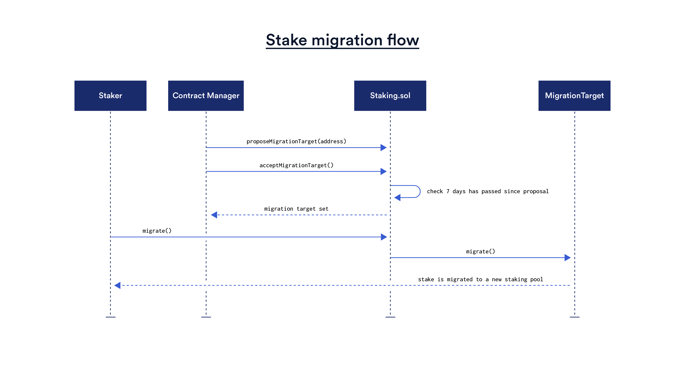

To avoid situations where a manager can frontrun migrations, a time lock mechanism is used which enforces a 7 day waiting period before v1 address is updated. This way, the manager can be prevented from being able to frontrun migrating stakers and set a malicious migration target contract.

**Note that stake migration is an opt-in feature triggered by each staker.** The contract manager cannot move staker funds on their behalf.

#### f. Concluding Staking v0.1

The _conclude_ operation is a one-way operation that will close the Staking v0.1 pool from new stake being added. It adjusts the rewards to stop accumulating and allow stakers to migrate their stake and rewards to a new staking pool or withdraw it to the staker’s address. **The _conclude_ operation also reclaims any unused (unreserved) reward amount back to the manager.**

**G. Withdrawing unused rewards**

The _withdrawUnusedReward()_ operation withdraws the remaining tokens that were not used for rewards. This amount is calculated by subtracting _reserved rewards_ from _available rewards_ when the pool was concluded.

#### b. Reward depletion

To reduce the trust requirement around rewards distribution, whenever the _addReward_ operation is called, an equivalent number of LINK tokens must be transferred. This ensures the Staking v0.1 pool always has enough LINK to reward all stakers.

Based on the max pool size, the reward rate, and available rewards (amount of LINK tokens transferred), the duration of how long the reward lasts can be calculated. To calculate the duration the following formula is used:

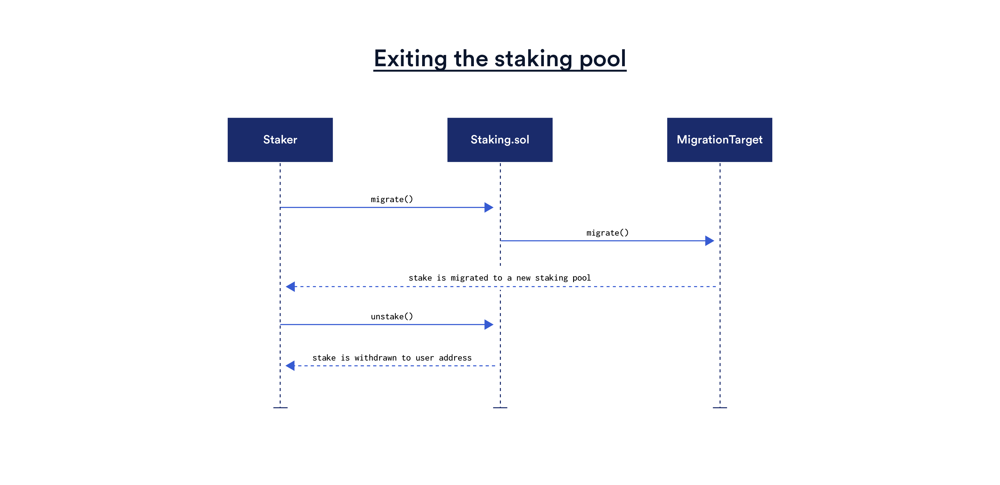

The contract validates that a reward is initialized with enough rewards for at least 1 month. This is a safety mechanism to guard against operational mistakes. In practice, it’s expected that the reward will be initialized with a longer duration.

Rewards can be extended by transferring additional LINK tokens and updating the reward _endTimestamp_. This operation only allows reward extensions.

The above introduces a need to keep track of reserved rewards so that the remainder can be used when extending the reward or withdrawn once the pool is closed. This is done using a **_reserved_** variable that would increase during a stake operation and decrease during an unstake operation. The reserved amount is calculated using reward variables set during the _addReward_ operation. This ensures that the reserved reward amount never exceeds the available reward amount.

**When the reward duration ends _(block.timestamp >= reward.endTimestamp),_ the rewards stop accumulating and the stakers are allowed to unstake—even without the manager calling conclude().** This is to help mitigate against scenarios where staker funds are locked up forever incidentally.

## 8. Unstaking and Migration

At the end of the Staking v0.1 program, stakers can exit the pool using either the _unstake_ or _migrate_ operations. Both operations have identical functionality and differ only in the recipient of the transfer - whether it is the msg.sender or the new staking contract.


Both operations update the staked balance (reducing it to zero), releasing unused reserved rewards (if any; more on that in the section that tackles the rewards mechanism), calculating the rewards and transferring them to the recipient.

Migration from v0 to v1 works as follows: When a staker calls _migrate_, the staker specifies some data that specifies a migration path. **This migration function enables stakers to easily move their stake from the Staking v0.1 pool to a new staking pool once it’s available.**

Note that stakers can still `unstake()` to exit the Staking v0.1 pool even when `migrate()` is available, in case of emergencies or if the rewards run out without a V1 address set.
